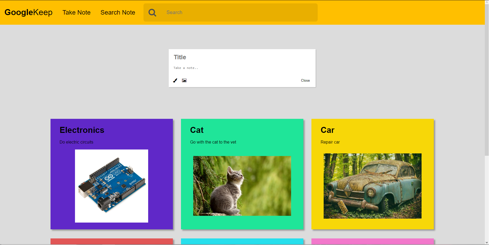
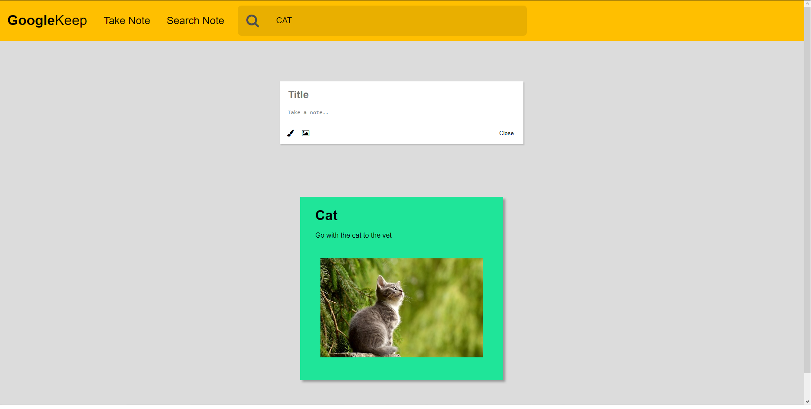
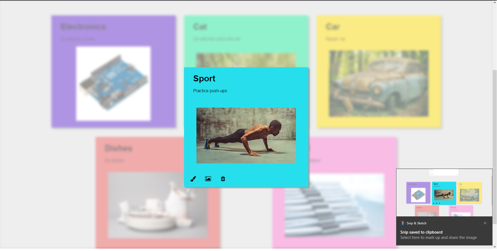

# Google Keep Clone

## Functionalities

---

The main function of Google Keep clone:

- Create a new note into database
- Customize a note color and image
- Get the notes from database
  
- Seach for a note
  
- Edit title,description,color or/and image of an note
- Delete a note
  

### Note:To open the db type **_json-server -w db.json_**
